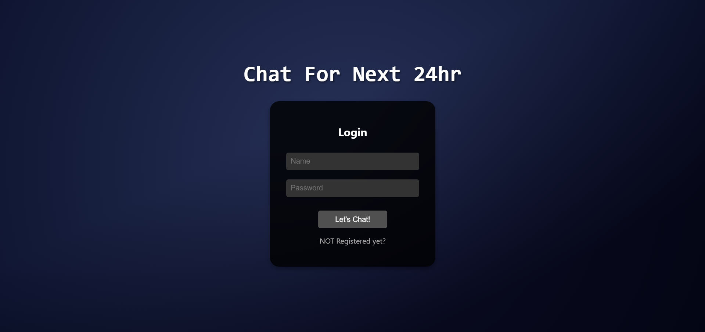
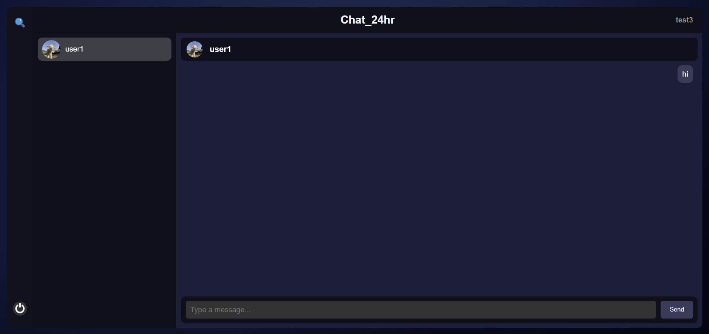
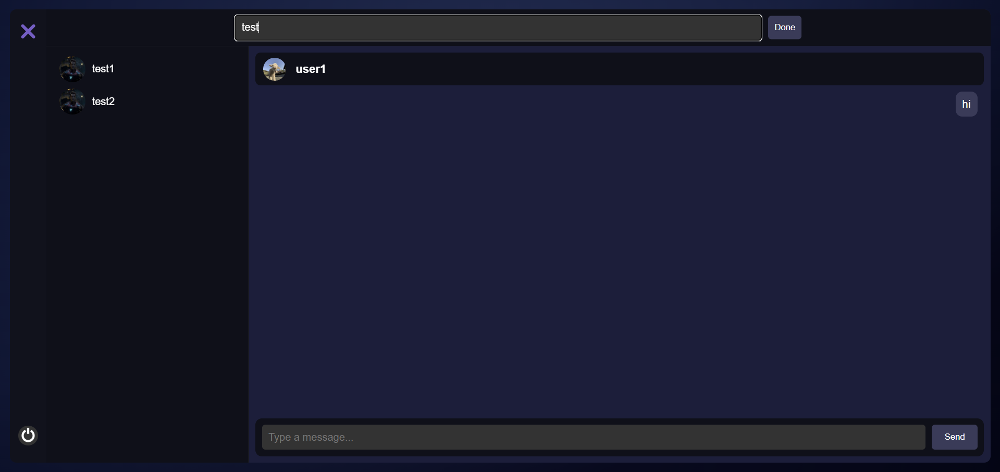

## **Chat Application**


### **Overview**
This repository contains the source code for a real-time chat application that supports user authentication, dynamic messaging, and efficient database management. The project comprises both a **frontend** and a **backend** system. Additionally, a separate repository handles database cleanup tasks via a **cron job**.



---

### **Features**
1. **Real-Time Messaging**:
   - Users can send and receive messages in real-time.
   - Old messages are retrieved from the database for seamless conversations.

   

2. **User Management**:
   - Dynamic user connections and disconnections are handled efficiently.
   - Integration with a separate cron job repository ensures expired users (accounts older than 24 hours) are automatically removed.

3. **Search and Navigation**:
   - Users can search for connections dynamically.
   - The selected connection scrolls into view for easy navigation.

   

5. **Data Integrity**:
   - Automatic cleanup of expired users and associated conversations using a separate cron job system.

---

### **Technologies Used**

- **Frontend**: (Hosted on [vercel](https://vercel.com/))
  - React.js
  - CSS for styling
  - WebSocket API for real-time communication
- **Backend**: (Hosted on [render](https://render.com/))
  - Django (Python)
  - WebSockets (via Django Channels) for real-time communication
  - MongoDB for database management
  - Redis for session and state management
- **Database Cleanup**:
  - MongoDB queries for user and conversation cleanup
  - Cron job in a separate repository

---

### **Directory Structure**

```
.
├── frontend/                     # React-based frontend
│   ├── components/               # Reusable React components
│   ├── styles/                   # CSS files for styling
│   └── App.js                    # Main React application
├── backend/                      # Django-based backend
│   ├── settings.py               # Django settings
│   ├── urls.py                   # URL routing
│   ├── views.py                  # API views
│   ├── consumers.py              # WebSocket handlers
│   └── models.py                 # Database models
├── cron-job/                     # Separate repository for cleanup
│   └── cleanup_script.js         # Handles expired user cleanup
└── README.md                     # Project documentation
```

---

### **Frontend**

#### **Key Components**
1. **Sidebar**:
   - Allows toggling of the search bar and logout.
   - Search is placed at the top, and logout is placed at the bottom for easy access.

2. **Header**:
   - Displays user-specific information.
   - Supports dynamic search functionality.

3. **ListOfConnections**:
   - Displays a list of user connections.
   - Automatically scrolls to the selected connection.

4. **ChatWindow**:
   - Displays messages with a typing effect for the header.
   - Handles message sending and retrieval.
   - Shows the online/offline status of the selected user using WebSocket communication.

#### **Styling**
- Custom CSS ensures a responsive and user-friendly interface.
- Animations and hover effects improve interactivity.

---

### **Backend**

#### **Core Functionalities**
1. **Django APIs**:
   - REST APIs to handle user connections and search.
   - Integration with MongoDB for persistent storage.

2. **WebSocket Communication**:
   - Real-time messaging between users using Django Channels.
   - Active user tracking and message handling.

3. **MongoDB Integration**:
   - Stores user and conversation data.
   - Ensures data consistency across sessions.

4. **Redis Integration**:
   - Tracks online users using Redis data structures.
   - Caches messages for efficient retrieval.

5. **Error Handling**:
   - Comprehensive error logging and handling to ensure smooth operation.

---

### **Database Cleanup (Cron Job)**

#### **Purpose**
The cron job is managed in a separate repository and is responsible for removing expired users (accounts older than 24 hours) and cleaning up related data.

#### **Process**
1. **Identify Expired Users**:
   - Queries the `users` collection for accounts older than 24 hours.
2. **Remove Expired Users**:
   - Deletes expired user records from the database.
3. **Update Connections**:
   - Removes references to expired users from other users' connection lists.
4. **Delete Conversations**:
   - Deletes chat records involving expired users.

#### **Repository Link**
The cron job repository can be found [here](https://github.com/jeetk04/Chat_Cron_Job).

#### **Deployment**
- Run the cleanup script periodically using a scheduler (e.g., `cron` or third-party services).

---

### **Environment Variables**

Create a `.env` file in the root directory of both the backend and cron job repositories and define the following variables:

#### **Backend**
```env
MONGODB_URI=mongodb+srv://<username>:<password>@cluster.mongodb.net/<dbname>
REDIS_HOST=<your-redis-host>
REDIS_PORT=<your-redis-port>
REDIS_PASSWORD=<your-redis-password>
```

#### **Cron Job**
```env
MONGODB_URI=mongodb+srv://<username>:<password>@cluster.mongodb.net/<dbname>
```

---

### **Setup and Installation**

#### **Prerequisites**
- Python
- Node.js
- MongoDB
- Redis

#### **Backend Setup**
1. Navigate to the backend directory:
   ```bash
   cd backend
   ```
2. Install dependencies:
   ```bash
   pip install -r requirements.txt
   ```
3. Run migrations:
   ```bash
   python manage.py migrate
   ```
4. Start the server:
   ```bash
   python manage.py runserver
   ```

#### **Frontend Setup**
1. Navigate to the frontend directory:
   ```bash
   cd frontend
   ```
2. Install dependencies:
   ```bash
   npm install
   ```
3. Start the React development server:
   ```bash
   npm start
   ```

#### **Cron Job Setup**
1. Navigate to the cron-job repository directory:
   ```bash
   cd cron-job
   ```
2. Install dependencies:
   ```bash
   npm install
   ```
3. Run the cleanup script manually (for testing):
   ```bash
   node cleanup_script.js
   ```
4. Schedule the script using `cron` or another scheduler for periodic execution.

---

### **Usage**

1. Start the backend server.
2. Start the frontend server.
3. Access the application in your browser (default: `http://localhost:3000`).
4. Use the app to chat, search connections, and view online/offline status.

---

### **Future Work**

- Integrate a **delete button** to delete the account instantly.
- Add options allowing users to choose the duration for holding their account.
- Add support for **message notifications**.
- Implement **group chats**.
- Optimize the frontend for **mobile devices**.
- Enhance search functionality with **fuzzy matching**.

---

### **License**

This project is licensed under the MIT License. See the LICENSE file for details.

---

### **Acknowledgments**
- React.js for the frontend framework.
- Django and Django Pymango for backend APIs.
- MongoDB for robust database management.
- Redis for efficient session and state management.

--- 

For further assistance, feel free to raise an issue or contribute to the repository!